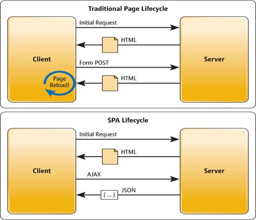

title: Application

# Application Architectures

There are different concepts, so I start giving a brief historic overview before going into details of modern concepts. Afterwards the different modern concepts are described.

## Desktop Applications

An application that runs stand-alone in a desktop or laptop computer. It runs on a PC operating system (Windows, Mac, Linux, etc.) as a binary distribution compiled for it. It should have a graphical user interface. Updates have to be installed locally.

Here a lot of programming languages may be used like C, Java...

## Client Server Application

If a desktop application is connecting to a server as centralized processing and data storage it is considered a client server application. The network connection mostly to servers in the local network is needed to work.

## Web Application

"Web-based application" are client server applications which require the Web browser to run in. They will store and process on the server and only the presentation layer is on the client within the browser. The browser will load the page with data included, render it and wait for user interaction. User actions can lead to a new page request, response, rendering

Here languages like PHP, Python, Java on the server are used delivering HTML, CSS, JavaScript to the browser for the UI.

Hera a lot of different concepts exist to further structure the architecture like multi tier, MVC...

## Single Page Application

A SPA is a website whose current page is updated dynamically rather than being entirely downloaded from a server. In other words, all the necessary application code for the web application like HTML, CSS and JavaScript needs to be loaded only once. As the user navigates through the web application, all contents and elements that need updating are fetched and re-rendered without requiring the user to reload the browser.

This saves the traditional round trip between the browser and the server, thus allows for faster interactions and better user satisfaction. Only the lean data elements are loaded on demand.

If the applications are big they tend to a long first loading time but then will present a fast reacting interface.

## Progressive Web Apps

An PWA is still a websites, but it just look and feel like an app, thanks to modern web technology.
Unlike SPA, a Progressive Web App (PWA) is more like a set of guidelines and checklists than a specific architecture and gives gives you

-   **Speed**: Given the same content, PWA loads faster than normal websites thanks to Service Workers technology. It is fast at first load and even faster on second loads onwards since it pre-caches all contents and delivers them when needed.
-   **Offline mode**: This is also made possible by Service Workers technology. All contents are pre-loaded the first time you visit the PWA and are delivered afterwards using Javascript. This is why it can work offline. After the first load It doesn’t need to request anything more from server to deliver the contents.
-   **Add to home screen**: This function prompts mobile users to “install” the PWA. After the user accepts the prompt, the PWA will be added to their mobile home screen, and it will run like any other installed app.

A service worker is one of the key technologies in PWA and it includes access to device-level functionality like camera & microphone, GPS, offline mode, file access, and many more.

## Sever Side Rendered

The most advantageous strategy is to rely on server-side rendering, a mature technique with rich tooling, which is not only perfect to render static content, but is also suitable for SEO and all connected to it.

One of the main reasons when you develop a SSR instead of a SPA is for taking care of the SEO. And SEO can be greatly improved by using the Quasar Meta Plugin to manage dynamic HTML markup required by the search engines.

{!docs/abbreviations.txt!}
