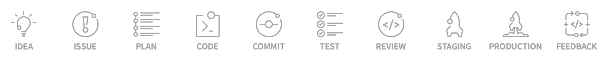

title: Overview

# Development Environment

To start developing in good quality a lot of things are needed. Nothing good is
coded just out of thin air. But what you need is depending on the position in the overall project flow you are in.

This is no straight line, it can make sense to go through this stages for each feature or release and to go back some times.

Most of the following mentioned tools are free for open source work but there are also powerful enterprise tools from which only Jira is mentioned here. The focus is on open source.

## Idea

Every project starts with the idea, which is developed through brainstorming, discussions and recherche.
Here you may need a mind mapping tool like [Freeplane](freeplane.md) mind mapping and communication tools.
Alternatively you may generated more structured graphs using a flow chart application like [yEd](https://www.yworks.com/products/yed).

## Issues

As a result of the initial idea you split up the overall idea into multiple issues which have to be done. For an update you may already have collected issues from your users. This issues will also show the progress.

[GitLab](gitlab.md) or [GitHub](github.md) also contains issue management or use [Trello](trello.md) as another simple tool. But there are lots of others like Jira (not free), Bugzilla and more, too.

## Planing

By organizing the issues into milestones and releases the ToDo list will be made. An agile planing with kanban boards like Backlog, ToDo, InWork, Done may help.

[GitLab](gitlab.md) or [GitHub](github.md) both also allows to work on issues and organize them.
Or use extensions like [ZenHub](https://www.zenhub.com/), [zube](https://zube.io/) or also Jira (not free) as enterprise system.

## Coding

While you work on the issues you have to write tests, code and documentation. Here a lot of tools are available per language which help you write code faster and keep a good structure.

As editor you may use [VS Code](vscode.md) or [Atom](atom.md) which are modern and work for every possible language. They have lots of features making them a small IDE but depending on your programming language you may use any of the big IDEs, too.

Useful documentation can be written using [markdown](../lang/markdown.md) and be converted into HTML using [MkDocs](mkdocs.md) later. This is the same way this book is written. Additionally you may more technical API out of the code structure and inline doc comments.

## Commit

Once you're happy with the code part or want to give the current state to others, you can commit version control using branches.

The big player in version control is [Git](git.md). You can use it directly or administer it through [GitLab](gitlab.md) or [GitHub](github.md) which both supports a lot more.

## Test

To make the code stable, it's best to make unit and integration tests for as much code as possible.

Each language has it's special tools here and you can also use CI to automate it.

## Review

For better quality a code review may be done.

Here the language specific API converted into HTML and the free manual formatted by [MkDocs](mkdocs.md) are needed.

## Staging

If possible first deploy to a staging area there the end users also can check the new version in a nearly production environment.

## Production

When we have everything working as it should, it's time to deploy to our production environment!

## Feedback

Now it's time to look back and check what stage of our work needs improvement. And finally go back the flow for the next release...

{!docs/abbreviations.txt!}
