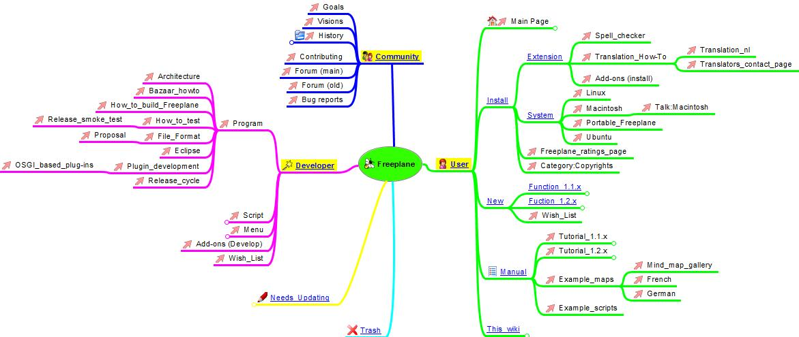

title: Freeplane

# Freeplane Mind Mapping Tool

[Freeplane](https://www.freeplane.org) is a free and open source software application that allows to create visual appealing structured information. It runs on any operating system that has a current version of Java installed.

A MindMap is a visualization of minds by putting words around a topic and connect them by lines. You will read it from the center outwards and get more detailed. It is made visual appealing by the use of colors, different shapes and symbols.

But to be productive with it, you need to learn the user interface first.

## Example

{: width="100%" }

_From the freeplane website_

## Usage

You start your MindMap with the topic in the center. To navigate you can use the mouse and menus, but to be effective you should do at least the essential data entering using keyboard shortcuts:

## Shortcuts

File commands:

-   New map - ++ctrl+n++
-   Open map - ++ctrl+o++
-   Save map - ++ctrl+s++
-   Save as - ++ctrl+a++
-   Print - ++ctrl+p++
-   Close - ++ctrl+w++
-   Quit - ++ctrl+q++
-   Previous map - ++ctrl+left++
-   Next Map - ++ctrl+right++
-   Export file to HTML - ++ctrl+e++
-   Export branch to HTML - ++ctrl+h++
-   Export branch to new MM file - ++alt+a++
-   Open first file in history - ++ctrl+shift+w++

New node commands:

-   Add sibling node - ++enter++
-   Add child node - ++insert++
-   Add sibling before - ++shift+enter++

Node editing commands:

-   Edit selected node - ++f2++
-   Edit long node - ++alt+enter++
-   Join nodes - ++ctrl+j++
-   Toggle folded - ++space++
-   Toggle children folded - ++ctrl+space++
-   Set link by filechooser - ++ctrl+shift+k++
-   Set link by text entry - ++ctrl+k++
-   Set image by filechooser - ++alt+k++
-   Move node up - ++ctrl+up++
-   Move node down - ++ctrl+down++

Edit commands:

-   Find - ++ctrl+f++
-   Find next - ++ctrl+g++
-   Cut - ++ctrl+x++
-   Copy - ++ctrl+c++
-   Copy single - ++ctrl+y++
-   Paste - ++ctrl+v++

Node formatting commands:

-   Italicize - ++ctrl+i++
-   Bold - ++ctrl+b++
-   Cloud - ++ctrl+shift+b++
-   Change node color - ++alt+c++
-   Blend node color - ++alt+b++
-   Change node edge color - ++alt+e++
-   Increase node font size - ++ctrl+l++
-   decrease node font size - ++ctrl+m++
-   Increase branch font size - ++ctrl+shift+l++
-   Decrease branch font size - ++ctrl+shift+m++

Node navigation commands:

-   Go to root - ++esc++
-   Move up - ++up++
-   Move down - ++down++
-   Move left - ++left++
-   Move right - ++right++
-   Follow link - ++ctrl+enter++
-   Zoom out - ++alt+up++
-   Zoom in - ++alt+down++

Mode commands:

-   MindMap mode - ++alt+1++
-   Browse mode - ++alt+2++
-   File mode - ++alt+3++

{!docs/abbreviations.txt!}
