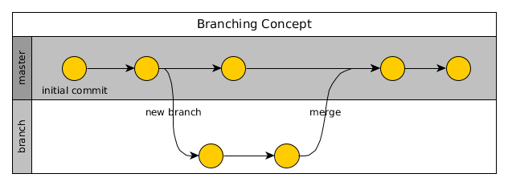
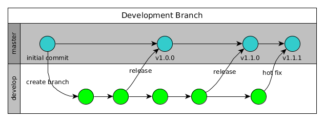
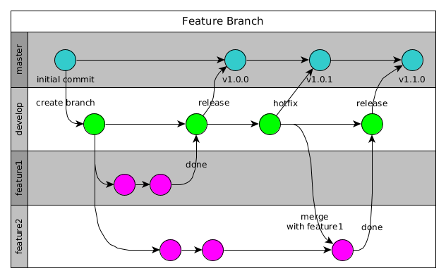
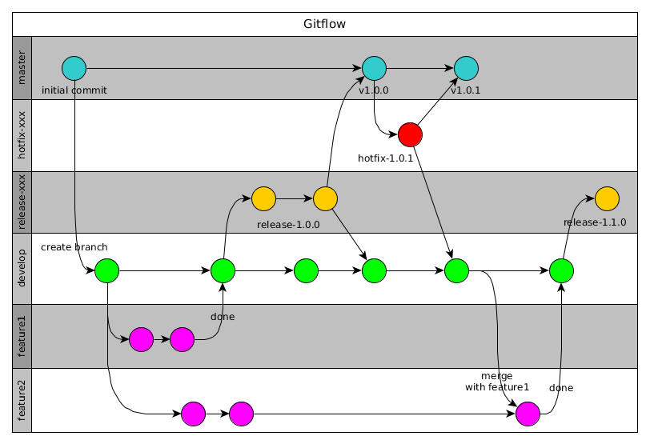

# Git

Version control is the only reasonable way to keep track of changes in code and
documentation. It allows to step back to any previous version easily.
But the really big advantage comes if multiple developers work together.

There are some different version control systems available but after the use of git
since some time it was clear to go on with it. Not only because it is good but also
because it has a lot of other advantages coupled with its tools.

[Git](https://git-scm.com/) is a free and open source distributed version control
system designed to handle everything from small to very large projects with speed
and efficiency.

Git is easy to learn and has a tiny footprint with features like cheap local branching,
convenient staging areas, and multiple workflows. Git revolutionized version control for when you have more than one developer working on a project.

Read more in the [Git book](https://git-scm.com/book/en/v2)

## Installation

At first install the repository software and CLI:

```bash
sudo apt-get install git-all
```

The setting of the default user will tell Git that you don’t want to type your
user name and email every time your computer talks to Git.

```bash
# use the settings you use on the central origin repository (maybe GitHub)
$ git config --global user.name alinex
$ git config --global user.email info@alinex.de
```

**Allow Password caching**

To also keep Git from asking for your password every time, you need to turn on the
credential helper so that Git will save your password in memory for some time:

```bash
git config --global credential.helper cache
```

This will keep the password for 15 minutes in memory. But you can also have Git
store your credentials permanently using the following:

```bash
git config --global credential.helper store
```

Note: While this is convenient, Git will store your credentials in clear text in a
local file `.git-credentials` under your “home” directory

## Basic Concept

The most common commands are shown in the following work flow. Here everything is
shown using CLI calls but you may use with any Git tool or your editors integration
for Git.

Git works with:

-   a **workspace** which is a view on the files in a specific branch at a defined time which you see also as files
-   the **staging** area is a collection of changes to be committed
-   the **local repository** which contains all data for the branches on your local machine
-   the **remote repository** also referred as the origin is the central storage (multiple are possible)

Using some git commands you can now transport data between the repositories:


Initially to work on an existing project you have to clone it first:

```bash
git clone <repository url>
cd <repo dir>
```

This will create a complete clone of the whole repository in a subdirectory with the
file name from the repository URL.

Instead you may also fork the repository which makes a copy of the repository on the server. This is useful on GitHub or GitLab if you can only read. The forked project is your own, you can do everything in it and also make a pull request back to the origin with your changes.

After changing something you have to add the changes:

```bash
git add -A <changed path>
```

If one change is done commit it with a short descriptive message (will be asked
interactively):

```bash
git commit
```

> Using `git commit -a` will do both steps in one go.

Later if your whole work is done you can push your local changes to the origin server
so that other developers will also get them.

```bash
git pull    # first pull the changes of others and merge them (automatically)
git push    # now send your own changes
```

If you reached a new major, minor or bug fix version or also a special state of the code you should
add a tag to get this version easily later:

```bash
git tag -a v1.4.0 -m 'version 1.4.0 with ....'
```

Here a new version 1.4.0 is tagged.

## Branching

Branching enables you to isolate your work from others. Changes in the primary branch or other branches will not affect your branch, unless you decide to pull the latest changes from those branches.

A branch in Git is simply a lightweight movable pointer to the last commit in a row.
All branches exist next to each other. Each Git repository (remote or local) contains at least the default `master` branch.

In the following figures the use of branches is visually displayed as swim lanes with circles for each commit.



With `git checkout -b <name>` a new branch will be created. You now work on this branch. The following commands may help further:

-   `git branch` to show the current branch
-   `git checkout <name>` to switch to another branch
-   `git branch -d <name>` to remove a branch

If you're done you may merge it with the master:

```bash
git checkout master
git merge <name>    # merge the named branch into master
```

Different branches can be merged into any one branch as long as they belong to the same repository.

To sync branches between local and remote repository you have to do it for each branch or use the `--all` switch:

```bash
git pull --all
git push --all
```

This two commands will get all remote changes of all branches to your local repository and then uploads all local changes and branches to the remote repository.

The organization of branches may differ on your needs, you may use Git here
in different ways.

### Central branch

In this approach the `master` branch serve as the single point-of-entry for all changes to the project.

This may be the right concept to start the work with git or for very small projects with a single developer it should also be sufficient. Later you can always switch to more sophisticated workflows by adding more branches.

In this concept you have to check that your code is fully functioning before you transfer your local changes to the remote repository. If you break it, you also break the master on the remote repository and after a `pull` for all other developers, too.
Therefore it is essential to tag the releases to find the last functioning point which can be used for production.

### Development branch

A good first s base is to make two main branches with infinite lifetime:

-   `master` - this branch contains production code.
    All development code is merged into master if released.
-   `develop` - this branch contains pre-production code.
    When the features are finished they are merged into develop.



No commits should be made in master directly.
It's also convenient to tag all merges to the `master` branch with a version number.

### Feature branches

The base idea is to let the development of each feature or topic take place in it's own branch. Often different teams work on different features and this way they won't disturb each other. The possibility of merge conflicts will be reduced if clear separation is done.



With each single feature or topic like a new package, a new function, or some kind of optimization a new feature branch will be created. It can be pushed to the central repository for backup/collaboration. It is branched from the `develop` branch which now takes the place of an integration branch. Changes on the `develop` branch should should only be small fixes.

The name of each feature branch should be descriptive like `newsBlog`. They should also be pushed to the remote repository to allow collaboration. And they also end if they are merged back to `develop`.

If the development is unsuccessful for a feature or stopped the branch can be discarded or kept open.

### Flow workflow

This workflow described by [Vincent Driessen](https://nvie.com/posts/a-successful-git-branching-model/) is especially for projects with release plan. It defines some branch names with specific roles. It is not only a model a specific [toolset](https://github.com/nvie/gitflow) for git will help you with it. Install git flow tools in Debian using `apt-get install git-flow`.



The base is to use a `develop` branch as described above with feature branches. But it will also add:

-   **release branches** are used as preparation for new production releases. Minor bugfixes and meta data changes (version numbers, build dates) are done here. They are named using the new release version like `release-1.2.0`. If done it they will merge to `master` and `develop`.
-   **hotfix branches** are like release branches but they are unplanned and be forged from the `master`. The normal development work can go on while the fix branched is made in parallel. If done it will be merged with `master` and the current release branch or `develop`.

Both are being deleted after they are merged.

Using the additional flow toolset:

-   `git flow init -d` will create the initial `develop` branch
-   `git flow feature start <your feature>` to start on a new feature
-   `git flow feature publish <your feature>` to push to origin
-   `git flow feature pull <your feature>` to pull from origin
-   `git flow feature finish <name>` to end a feature by merging with `develop`
-   `git flow release start <release> [<base>]` start a release branch from `<base>` on `develop`
-   `git flow release finish <release>` this will merge to master
-   `git flow hotfix start <release> [<base>]`
-   `git flow hotfix finish <release>`

### Support branches

Support branches are essential if you need to maintain multiple major versions at the same time. You could use support branches for supporting minor releases as well. They will be forged from the `master` and are a dead end, so no need to merge with `develop` anytime.

Name them with the version pattern they will support like `support-1.x` or support `1.4.x`. There may also be hotfix branches which are based on it.


If a hotfix only for a support branch is made it only have to be merged back to the support branch.

This can be used in addition to any of the other workflows.

### Conclusion

There is no one-size-fits-all workflow, it should be simple and enhance the productivity of your team. And it should fit in with your business requirements and project workflow.

If decided it should be documented how to work, to be convenient over your projects and help the developers to concentrate on their real work.

To keep a clean history you should use `--no-ff` on merges.

## Merges

To bring the changes of two branches or repositories together you have to merge them. Mostly you merge a branch back to another branch or the changes between the local and origin repository.

-   `git merge <branch>` will try to merge the given branch into the current
-   `git merge --abort` on merge conflicts you may abort the merge
-   `git merge --continue` go on after conflict is solved

Git will decide how the changes from the last common commit will be put together.
The **fast-forward** algorithm will be used when a linear path exists and will put all commits of the given branch behind the current one.
This behavior can be suppressed with the `--no-ff` option.

If changes were made in both branches git has to use the **3-way merge**.
If in both branches changes exist in the same file on the same position it will result in a merge conflict.

```bash
$ git merge iss53
Auto-merging index.html
CONFLICT (content): Merge conflict in index.html
Automatic merge failed; fix conflicts and then commit the result.
```

To get an overview of the conflicts you can always call `git status`.

Within the conflicting file you will find one or multiple markers:

```diff
<<<<<<< HEAD
<div id="footer">contact : email.support@the.net</div>
=======
<div id="footer">
please contact us at support@the.net
</div>
>>>>>>> iss53
```

The first is the version from the current branch, while the second is from the merging branch.
You have to solve it by replacing the whole part with the correct content (one, the other or a new one).

To solve this in a graphical tool use `git mergetool` and if fixed add the changes in the normal way using `git add` and `git commit`.

## Worktree

In git it is possible to work in multiple branches in parallel, so while working on a new feature you can create a parallel directory with the master branch to make a hotfix and have both in your editor at the same time.

```bash
# create an parallel worktree for master
git worktree add ../my-repo-master master
# remove it after done
git worktree remove ../my-repor-master
```

You can also open a new branch as worktree:

```bash
# create an parallel worktree for master
git worktree add -b f_branch ../my-repo-feature origin/master
```

## Submodules

Git allow you to modularize your repository. This is done by the use of submodules which are references to other git repositories.

To add a sub repository in a folder of the current repository use:

```bash
git submodule add https://github.com/<user>/<repo> lib/path
```

If you go into the submodule path you will directly work in the submodule's repository!

If this submodule may have changed you should update submodules from the base folder of the parent repository:

```bash
git submodule update --init --recursive
```

To checkout a project using submodules best way is to use:

```bash
git clone --recursive <project url>
```

### Extract path

To create a new repository out of some files, you have to clone the repository to a new folder on your machine and run:

```bash
git filter-branch --subdirectory-filter <path> -- --all
```

This will erase all data from the repository which is not related to this sub path.

Now you have to create the new repository and change the origin to this one:

```bash
git remote set-url origin https://github.com/<user>/<new repo>
git push
```

Now the extracted repository is ready, but you have to replace the code with the submodule now in the original repository:

```bash
git rm -r <path>
git commit -m "Remove path (preparing for submodule)"
```

Then add it again as submodule:

```bash
git submodule add https://github.com/<user>/<new repo> <path>
git commit -m "path submodule"
```

Don't forget to mention to all collaborators that submodules are used and to make recursive clones and updates.

### Remove

To remove a git submodule the following steps are needed:

```bash
git submodule deinit -f -- a/submodul
rm -rf .git/modules/a/submodule
git rm -f a/submodule
```

## Special use cases

### Moving repository

First you have to fetch all remote branches:

```bash
git fetch origin
```

Now check if all branches are local:

```bash
git branch -a
```

If there are some branches listed as remote which didn’t exist as local ones you
have to check them out:

```bash
git checkout -b <name> origin/<name>
```

Now define a new remote repository:

```bash
git remote add new-origin <url>
```

Everything set up so you may transfer the repository:

```bash
git push --all new-origin
git push --tags new-origin
```

At last you may delete the old origin and rename it:

```bash
git remote rm origin
git remote rename new-origin origin
```

Pull/push to origin

Use the preset names:

```bash
git pull origin master
git push origin master
```

### Subversion Integration

If you have a subversion server as master you may also use git for your work and sync the changes back to subversion as the master repository.

To use this you have to install the extension:

```bash
apt-get install git-svn
```

To do so you first init your git repository from the subversion master and load the initial data:

```bash
$ git svn clone -s https://subversion.local/svn/my-repo
# -s is for --stdlayout which presumes the svn recommended layout for tags, trunk, and branches
# if your repo don't use that remove this option
```

If you don’t want the complete history you may use:

```bash
$ git svn clone -s -r 40000:HEAD https://subversion.local/svn//my-repo
# -r is for the revision to start taking history from
```

To update your repository to HEAD of subversion master run:

```bash
git svn rebase
```

And to push your commits further to subversion:

```bash
git svn dcommit
```

### Working with forks

If you have a fork you may add an additional remote repository:

```bash
git remote add upstream
```

To sync this you have to:

```bash
git fetch upstream
git checkout master
git merge upstream/master
```

## Server Setup

If you want to use your own central repository you have to setup a git server:

### Install the required package

```bash
sudo apt-get install -y git-core
```

### Authenticated ssh access

Next you create a local user to access git using ssh:

```bash
sudo adduser git
su git
cd
mkdir .ssh && chmod 700 .ssh
touch .ssh/authorized_keys && chmod 600 .ssh/authorized_keys
```

Next you need to add each developer SSH public keys to the authorized_keys file for
the git user.

```bash
cat /tmp/id_rsa.john.pub >> ~/.ssh/authorized_keys
```

Now, you can set up an empty repository for them as described below.

    The address will be git@gitserver:/var/git/project.git

You can easily restrict the git user to only doing Git activities with a limited
shell tool called git-shell that comes with Git.

```bash
cat /etc/shells       # see if `git-shell` is already in there.  If not...
which git-shell       # make sure git-shell is installed on your system.
sudo vim /etc/shells  # and add the path to git-shell from last command
sudo chsh git         # and enter the path to git-shell, usually: /usr/bin/git-shell
```

Now, the git user can only use the SSH connection to push and pull Git repositories and can’t shell onto the machine. If you try, you’ll see a login rejection like this:

```bash
$ ssh git@gitserver
fatal: Interactive git shell is not enabled.
Connection to gitserver closed.
```

### HTTP Access

This is done using the Apache web server with its possibilities.

Add the following to the Apache site configuration:

```text
SetEnv GIT_PROJECT_ROOT /var/git
SetEnv GIT_HTTP_EXPORT_ALL
ScriptAlias /git/ /usr/lib/git-core/git-http-backend/

<Directory "/usr/lib/git-core*">
    Options ExecCGI Indexes
    Order allow,deny
    Allow from all
    Require all granted
</Directory>

<LocationMatch "^/git/">
    AuthType Basic
    AuthName "Git Access"
    AuthUserFile /etc/apache2/git.passwd
    AuthGroupFile /etc/apache2/git.groups
    Require valid-user
</LocationMatch>
```

Now you may access the server.

### Web Interface `gitweb`

```bash
apt-get install -y gitweb
```

### Create a new server repository

First create a bare repository:

```bash
git --bare init <myrepo>
cd <myrepo>
git --bare update-server-info
cd ..
chown -R www-data:www-data <myrepo>
```

Now make a new local repository:

```bash
git init <path>
```

After you have everything committed add the remote and push the repository:

```bash
git remote add origin <url>
git push --all origin
git push --tags origin
```

Add the login credentials in the `.netrc` file which is used by curl:

```bash
$ cat ~/.netrc
machine <git.yourdomain.com>
login reader
password reader
```

### Migrate from Subversion

Best way is to use [git-svn-migrate](https://github.com/JohnAlbin/git-svn-migrate), which can also convert multiple repository at once.

{!docs/abbreviations.txt!}
