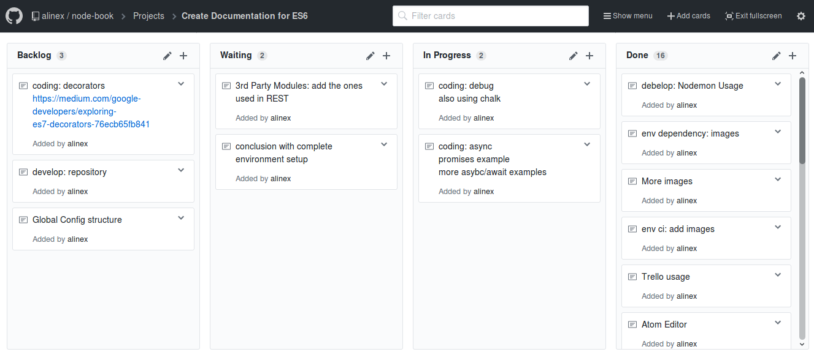

# GitHub

GitHub adds a staging platform to share prototypes and open-source projects.

[GitHub](https://github.com) is a free code hosting platform for version control and
collaboration with open source. It lets you and others work together on projects from
anywhere. On top of the Git repository management it supports further services like

- Git viewer
- Integrated CDN
- Issue reporting and management
- Wiki pages
- Static site
- Easy collaboration

If you use GitHub there is no need to setup your own Git server anymore.
It’s surprisingly easy to get things set up and most tasks can be done directly by
clicking in the web front end.

You can also use a badge on your `README.md` like:

```markdown
[](https://github.com/alinex/node-rest/subscription)
[](https://github.com/alinex/node-rest)
[](https://github.com/alinex/node-rest)

[](https://github.com/alinex/node-rest/issues)
```

## GitHub Setup

The use of GitHub itself has already been described so here we go on with some help
on how to use GitHub with issues and planning.

### Create a new project

Each repository can have multiple projects. You only need a Title and description
to create a new one. After that it should be empty.

To work within the project it is best to go to "Full-screen" mode (more like full
window mode) with the button on the right side. Only in this mode scrolling right/left
works.

### Add columns

The project view comes in form of a Kanban board like often used in Agile Development
and tools like Jira, Trello...

Therefore you have to define your columns. A good starting point will be to
name them.

Simply:

- Waiting
- In Progress
- Done

Agile:

- Backlog
- Ready
- In Progress
- Test
- QA
- Done



### Cards

Within each column you can add cards and drag+drop them between the columns to show
the current state. You have two possibilities of cards:

#### Notes

This are simple information or tasks which only consists of an title. They are only
visible here and can be converted to issues as needed.

#### Issues

That are some real tasks with lots of possibilities:

- More details
- Possible discussion
- Pull Requests
- and more


{!docs/abbreviations.txt!}

