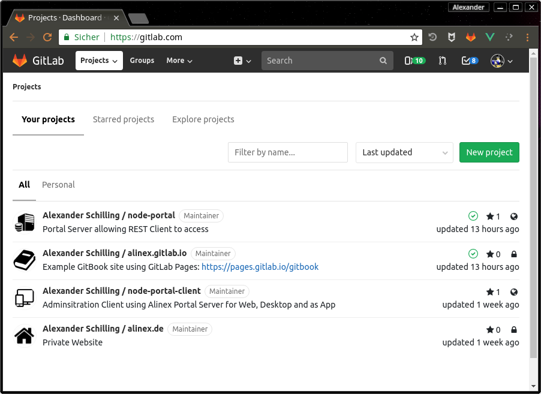
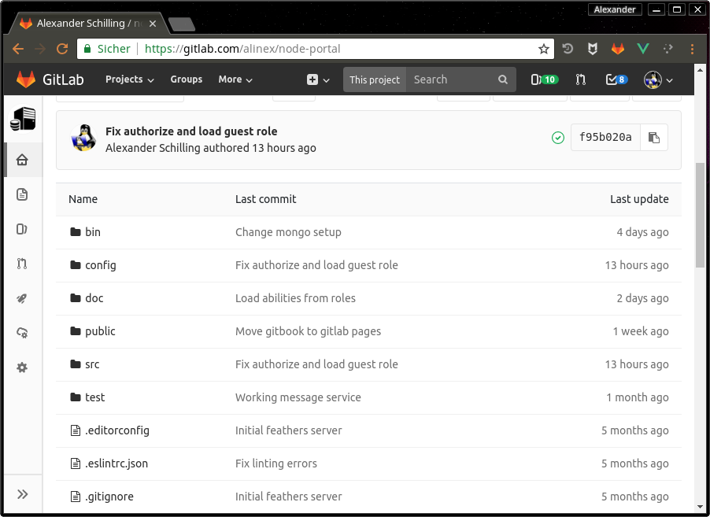
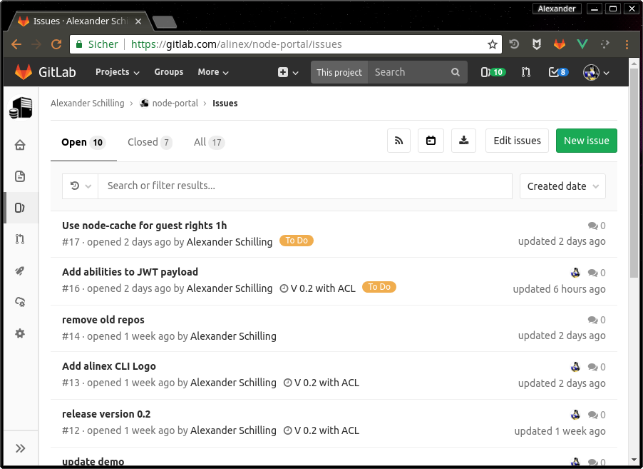
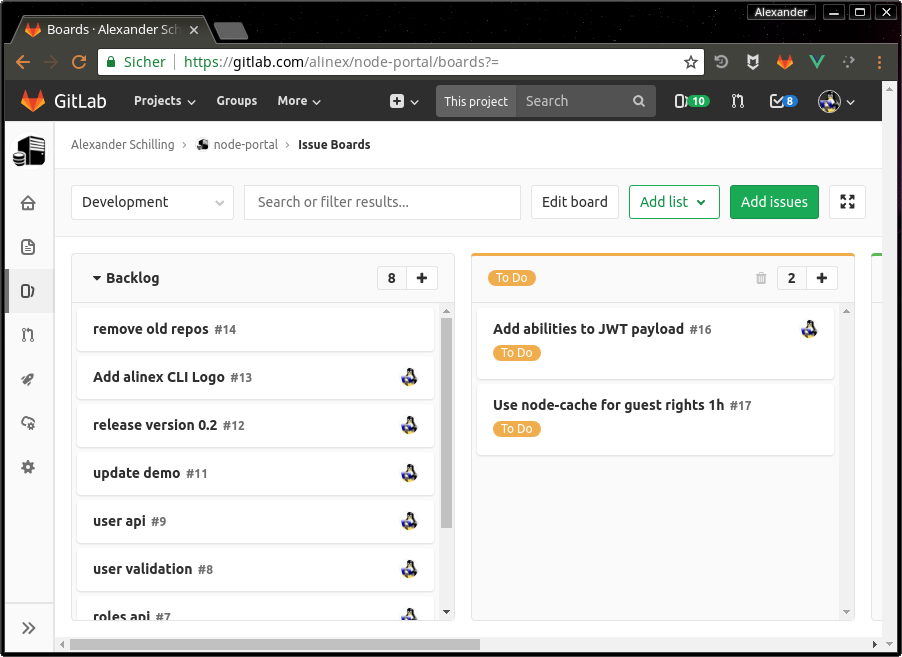
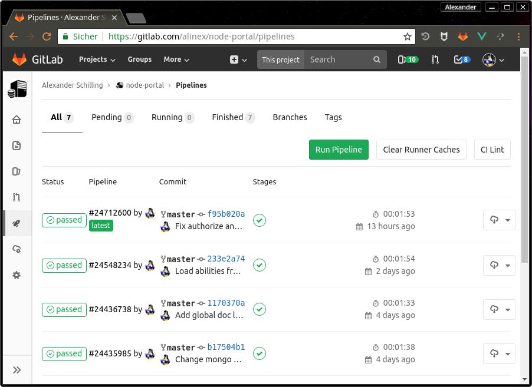

# GitLab

As [GitHub](github.md) this is also web based environment around git repositories,

Beside providing a centralized, cloud-based location where teams can store, share, publish, test, and collaborate on development projects using git. [GitLab](https://gitlab.com) adds an web based administration and integration tools. In contrast to GitHub, GitLab is also install-able to be self hosted.

## Basics

GitLab is a web-based repository manager that lets teams collaborate on code, duplicate code to safely create and edit new projects, then merge finished code into existing projects. GitLab is written in the Ruby programming language and includes a Wiki and issue-tracking features. It has different versions: GitLab Community Edition (CE), Enterprise Edition (EE), and a GitLab-hosted version, GitLab.com. It’s got over 1400 contributors and is used by major organizations like Alibaba, NASA, CERN, and more.

Its permissions, branch protection, and authentication features are what really make it stand out. Teams can secure projects on a more granular level, and projects are kept even safer while they’re being worked on.

Its special features include:

-   It’s free and open-source.
-   Different hosting options: Self-hosted with the Core, Starter, Premium and Ultimate plans, and GitLab hosted SaaS options with the Free, Bronze, Silver and Gold plans.
-   A convenient user interface enables users to access everything from one screen: projects, latest projects, users, latest users, groups, and stats.
-   Settings allow users to control whether a repository is public or private.
-   “Snippet support” lets users share small pieces of code from a project, without sharing the whole project.
-   Protected branches are a new way to keep code safe. They allow users to set higher permissions on a project, so only certain people are able to push, force push, or delete code in a branch.
-   Authentication levels take this security a step further, allowing users to give people access beyond a read/write level. For example, you can give a team member access to issue tracking without having to give them access to the code itself.
-   Improved milestones enable you to set milestones at a group level, not just a developer-specific level. Developers can get insight into the whole team’s scope and view the entire project’s milestones, not just their own.
-   With the “Work in Progress” status, developers can label a project `WIP` to let collaborators know that the code is unfinished. This prevents it from accidentally getting merged with other code before it’s finished.
-   You can attach files like comments to any communications in GitLab.
-   Kubernetes cluster monitoring with the Ultimate, Silver, and Gold hosting plans
-   Integration with Jira, Confluence, Trello, Jenkins and more.

## Impressions

The best way is to just check it out but at first I will give some graphical impression of how to work with the GitLab Web-view.

This is the start page and shows all your projects or projects you are a member of.

The code view in GitLab is nearly the same a s known from GitHub. You can browse through the directory structure, show file contents, change branches, tags or use the version history...

Your work can be planed and controlled using the integrated issue tracker with labels, assignees, milestones...

Really great is also a simple planning board to organize the big list of issues better.

Through CI/CD Pipelines you can define automatic tasks with specific triggers. Also a direct look into the pipeline output (necessary in case of errors) is possible and you can see the whole command line output.

## Access Levels

Members of a group or project can have one of the following access levels:

-   **Guest** to look into and create issues or add comments
-   **Reporter** to manage and assign issues
-   **Developer** to make commits and work with branches, merges
-   **Maintainer** to add team members and manage CI/CD
-   **Owner** to switch visibility and delete part or whole project

In the default the `master` branch can also only be merged and pushed by the maintainer. But this may be changed under Settings -> Repository.

External users can only access projects to which they are explicitly granted access, thus hiding all other internal or private ones from them. Access can be granted by adding the user as member to the project or group.

## Merge Requests

Instead of merging using `git` on the console or in your UI tool, It can be also done through the graphical website.

To do this the last changes have to be pushed to the origin server (GitLab).

1. Open the project you want to merge to in GitLab
2. Select "New merge request" on the right side
3. Now select the source branch and target branch
4. Click on the "Compare branches and continue" button and fill out the form
5. Click on the "Submit merge request" button

## CI/CD Pipelines

By giving a `.gitlab-ci.yml` configuration within the project this can be setup.
The YAML file defines a set of jobs with constraints stating when they should be run.

Jobs are picked up by Runners and executed within the environment of the Runner. What is important, is that each job is run independently from each other.

## Pages

You can have a static site included in GitLab. This may be done using [MkDocs](mkdocs.md) or [GitBook](gitbook.md) using the CI Pipeline to generate the pages.

## Summary

This is a great tool which really helps in the complete process of software development and brings all the basics in one product.

{!docs/abbreviations.txt!}
