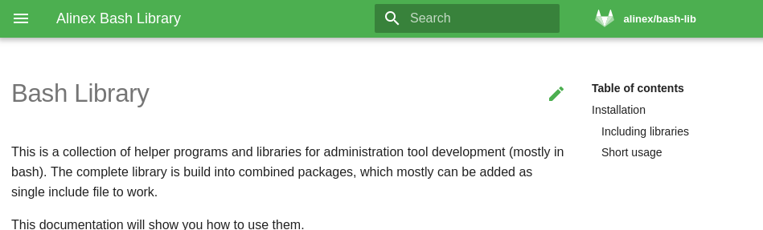
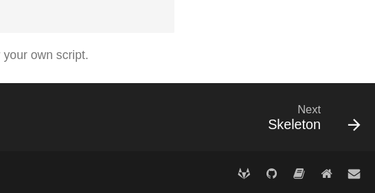

# MkDocs

As an alternative to GitBook, MkDocs is a fast and simple static site generator with template, plugin and extension support. Documentation source files are written also in Markdown, and configured with a single YAML configuration file.

The following description use the material theme but others are possible, too.
Material theme has responsive design and fluid layout for all kinds of screens and devices, designed to serve your project documentation in a user-friendly way in 34 languages with optimal readability.
Some basic customization like primary and accent color, fonts... could be configured.

Also a collection of useful extensions are included here, too. So this is not only a description of the basics but presenting you a fully usable and optimal setup of it.

## Install

On Debian the following steps should be enough to get it locally running:

```bash
sudo apt install build-essential python3-dev python3-pip python3-setuptools python3-wheel python3-cffi libcairo2 libpango-1.0-0 libpangocairo-1.0-0 libgdk-pixbuf2.0-0 libffi-dev shared-mime-info
```

Take care that you use python 3!

```bash
$ ll -al $(which python)
lrwxrwxrwx 1 root root 18 Mär  8 10:03 /usr/bin/python -> /usr/bin/python3.6*
```

If this points to python 2.7 change that first.

Now you can install the python packages:

```bash
python -m pip install --upgrade pip
python -m pip install mkdocs
python -m pip install mkdocs-material
python -m pip install pymdown-extensions
python -m pip install markdown-blockdiag
python -m pip install markdown-include
python -m pip install mkdocs-pdf-export-plugin
```

To make it accessible in path, add the following to `~/.bashrc`:

```bash
PATH=$PATH:~/.local/bin
```

And for the epub conversion you need to have calibre installed:

```bash
curl -sL https://download.calibre-ebook.com/linux-installer.sh | sudo -E bash -
```

### Problems

#### mkdocs could not be installed

If the above wont install `mkdocs` try to install some tools first:

```bash
sudo apt-get install python-setuptools
python -m pip install wheel
```

After that retry to install `mkdocs` and it's extensions.

#### Problem with cairocffi

Maybe your cairocffi version is not matching and you get some errors like `Requirement.parse('cairocffi>=0.9.0'), {'weasyprint'})`, then you can check your version like:

```bash
$ python -m pip show cairocffi
Name: cairocffi
Version: 0.9.0
...
```

To install a specific version use:

```bash
python -m pip uninstall  cairocffi
python -m pip install cairocffi==1.0.1
```

## Preview Server

While you are working on the documentation and create new stuff it is often necessary to immediately see how it looks like. This is possible if you start an development server of `mkdocs` using:

```bash
mkdocs serve # from within the project home
```

This will start an development server which automatically reloads on changes.

## Build Documentation

To create the documentation in the `site` sub folder use:

```bash
mkdocs build
```

And to also create a PDF use:

```bash
ENABLE_PDF_EXPORT=1 mkdocs build
```

> In the setup below the PDF will be stored under `site/alinex-book.pdf`.

## Configuration

The setup is completely done in a `mkdocs.yml` file within your project's root directory.

First some descriptive information for the site:

```yaml
site_name: Alinex Development Guide
site_description: A book to learn modern web technologies.
site_author: Alexander Schilling
copyright: Copyright &copy; 2016 - 2019 <a href="https://alinex.de">Alexander Schilling</a>
```

While the `site_name` is used as heading the `site_description` and `site_author` goes into the meta data. And the `copyright` line will be displayed in the footer with optional HTML links as seen above.

The navigation may be auto detected or defined using a navigation structure:

```yaml
nav:
    - Home:
          - README.md
          - alinex.md
    - Languages:
          - Overview: lang/README.md
          - Markdown: lang/markdown.m
          - Handlebars: lang/handlebars.md
```

Chapters can not contain a direct page.
A title can be given for each page. If not the title setting at the top of each page is used or the first heading.

Now the theme definition, here we use the [material](https://squidfunk.github.io/mkdocs-material/) theme as a basis:

```yaml
theme:
    name: material
    icon:
        logo: material/book-open-variant
    favicon: assets/favicon.ico
    language: en
    palette:
        primary: grey
        accent: orange
    font:
        text: Roboto
        code: Roboto Mono
    feature:
        tabs: true
```

The `logo` can be a name from the [material icons](https://material.io/icons/) (displayed on the top left beside the page heading). The `favicon` has to be set to an image within the `docs` folder.
If `feature/tabs` is set the first level of navigation is put at tabs on the top.

```yaml
repo_name: 'alinex/alinex.gitlab.io'
repo_url: 'https://gitlab.com/alinex/alinex.gitlab.io'
edit_uri: ''
```

{: .border}

Like shown in the image the repository will be displayed on the right and if no `edit_uri: ""` is set an icon to edit the page source is added, too. To prevent this in the example config `edit_url` is set to an empty string.

```yaml
extra:
    social:
        - icon: material/gitlab
          link: https://gitlab.com/alinex
        - icon: material/github
          link: https://github.com/alinex
        - icon: material/home
          link: https://alinex.de
```

{: .border}

The social links use the [FontAwesome](http://fontawesome.io/icons/) names as type with a link. They will be displayed at the bottom right corner of the page.

```yaml
extra_css:
    - assets/extra.css
```

With the `extra_css` section you may add more stylesheets to the generated HTML which are used to:

-   optimize the theme
-   to be used with [attributes](#attributes)

Such an CSS file may look like:

```css
{!docs/assets/extra.css!}
```

And at last some plugins and extensions for more markdown possibilities like described below:

```yaml
plugins:
    - search
# Enable for PDF export
#PDF#    - pdf-export:
#PDF#          verbose: false
#PDF#          media_type: print
#PDF#          combined: true
#PDF#          combined_output_path: alinex-book.pdf

markdown_extensions:
    - extras
    - toc:
          permalink: true
    - pymdownx.caret
    - pymdownx.tilde
    - pymdownx.mark
    - admonition
    - pymdownx.details
    - codehilite:
          guess_lang: false
          linenums: false
    - pymdownx.inlinehilite
    - pymdownx.tabbed
    - pymdownx.superfences
    - pymdownx.betterem:
          smart_enable: all
    - pymdownx.emoji:
          emoji_generator: !!python/name:pymdownx.emoji.to_svg
    - pymdownx.keys
    - pymdownx.smartsymbols
    - pymdownx.tasklist:
          custom_checkbox: true
    - markdown_blockdiag:
          format: svg
    - markdown_include.include
```

See the complete setup of [this book](https://gitlab.com/alinex/alinex.gitlab.io/blob/master/mkdocs.yml).

The PDF plugin is marked with special comments to be enabled by a short script if needed only. See below.

> If VS Code with the Prettier plugin is used, set the tab width to 4 spaces for correct Markdown formatting in MkDocs.

### PDF and ePub Export

The already installed and included pdf-export plugin together with calibre will do both for you.

Run the `./mkdocs-pdf.sh` script which will:

1. make a copy of mkdocs.yml
2. enable the `#PDF#` lines
3. build documentation with included PDF
4. convert PDF to ePub
5. cleanup

## Writing Documentation

Pages are written in markdown Format and stored as `*.md` files within the `doc` folder. The [Markdown](https://toolchain.gitbook.com/syntax/markdown.html) implementation is nearly
the same as used on GitHub but with some additions:

### Navigation title

To set an alternative title within the navigation define it at YAML at the top:

```markdown
title: Test Page

# Test

...
```

### Simple Formats

Structure the text using headings:

```markdown
# Heading 1

## Heading 2

### Heading 3
```

Blockquotes are done using `>` signs:

```markdown
> This is a block quote in which only the first line of the paragraph needs
> to be indented by `>` but it can also be done on each line.
```

> This is a block quote in which only the first line of the paragraph needs
> to be indented by `>` but it can also be done on each line.

A horizontal line may be used to separate:

```markdown
---
```

---

Use some inline text formatting:

| Format              | Example                       | Result                                    |
| ------------------- | ----------------------------- | ----------------------------------------- |
| Italic              | `_Italic_` or `*Italic*`      | _Italic_                                  |
| Bold                | `__Bold__` or `**Bold**`      | **Bold**                                  |
| Superscript         | `H^2^O`                       | H^2^O                                     |
| Subscript           | `CH~3~CH~2~OH`                | CH~3~CH~2~OH                              |
| Insert              | `^^Insert^^`                  | ^^Insert^^                                |
| Delete              | `~~Delete me~~`               | ~~Delete me~~                             |
| Mark                | `==mark me==`                 | ==mark me==                               |
| Emoji               | `:smile:`                     | :smile:                                   |
| Code                | \`echo "Hello"\`              | `echo "Hello"`                            |
| Code + Highlighting | \`:::bash echo "Hello"\`      | `:::bash echo "Hello"`                    |
| Keys                | `++ctrl+alt+h++`              | ++ctrl+alt+h++                            |
| Link                | `[Text](http://my-site.com)`  | [Text](http://my-site.com)                |
| Image               | ``        |         |
| Image (Zoom)        | `{.tiny}` | {.tiny} |

### Lists

Unordered list:

```markdown
-   water
-   cola
-   beer
```

-   water
-   cola
-   beer

Ordered list:

```markdown
1. select
2. take
3. buy
```

1. select
2. take
3. buy

And finally a task list is also possible:

```markdown
-   [x] item 1
    -   [x] item A
    -   [ ] item B
            more text
        -   [x] item a
        -   [ ] item b
        -   [x] item c
    -   [x] item C
-   [ ] item 2
-   [ ] item 3
```

-   [x] item 1
-   [x] item A
-   [ ] item B
        more text
-   [x] item a
-   [ ] item b
-   [x] item c
-   [x] item C
-   [ ] item 2
-   [ ] item 3

### Tables

Tables can have alignment:

```markdown
| Left | Center | Right |
| :--- | :----: | ----: |
| one  |  two   | three |
| 1    |   2    |     3 |
```

| Left | Center | Right |
| :--- | :----: | ----: |
| one  |  two   | three |
| 1    |   2    |     3 |

### Block Messages

The [Admonition](https://python-markdown.github.io/extensions/admonition/) extension configured above will allow to add text blocks.

```markdown
!!! note

    Lorem ipsum dolor sit amet, consectetur adipiscing elit. Nulla et euismod
    nulla. Curabitur feugiat, tortor non consequat finibus, justo purus auctor
    massa, nec semper lorem quam in massa.
```

!!! note

    Lorem ipsum dolor sit amet, consectetur adipiscing elit. Nulla et euismod
    nulla. Curabitur feugiat, tortor non consequat finibus, justo purus auctor
    massa, nec semper lorem quam in massa.

The different types will look like:

!!! note

    Type: `note`, `seealso`

!!! abstract

    Type: `abstract`, `summary`, `tldr`

!!! info

    Type: `info`, `todo`

!!! tip

    Type: `tip`, `hint`, `important`

!!! success

    Type: `success`, `check`, `done`

!!! question

    Type: `question`, `help`, `faq`

!!! warning

    Type: `warning`, `caution`, `attention`

!!! failure

    Type: `failure`, `fail`, `missing`

!!! danger

    Type: `danger`, `error`

!!! bug

    Type: `bug`

!!! example

    Type: `example`, `snippet`

!!! quote

    Type: `quote`, `cite`

The title can also be specified in double quotes behind the type or remove the title by setting `""` for title:

```markdown
!!! note "Individual"
```

!!! note "Individual"

The [`PyMarkdown.Details`](https://facelessuser.github.io/pymdown-extensions/extensions/details/) extension gives the same but as collapsible boxes:

```markdown
??? note "Initially closed"

    Lorem ipsum dolor sit amet, consectetur adipiscing elit. Nulla et euismod
    nulla. Curabitur feugiat, tortor non consequat finibus, justo purus auctor
    massa, nec semper lorem quam in massa.

???+ note "Initially opened"

    Lorem ipsum dolor sit amet, consectetur adipiscing elit. Nulla et euismod
    nulla. Curabitur feugiat, tortor non consequat finibus, justo purus auctor
    massa, nec semper lorem quam in massa.
```

??? note "Initially closed"

    Lorem ipsum dolor sit amet, consectetur adipiscing elit. Nulla et euismod
    nulla. Curabitur feugiat, tortor non consequat finibus, justo purus auctor
    massa, nec semper lorem quam in massa.

???+ note "Initially opened"

    Lorem ipsum dolor sit amet, consectetur adipiscing elit. Nulla et euismod
    nulla. Curabitur feugiat, tortor non consequat finibus, justo purus auctor
    massa, nec semper lorem quam in massa.

### Tabs

Using [Tabbed](https://facelessuser.github.io/pymdown-extensions/extensions/tabbed/) groups as tabs can be defined:

````markdown
=== "Bash"

    ```bash
    #!/bin/bash

    echo "Hello world!"
    ```

=== "Explanation"

    This is only a short example of how to make tabs.
````

=== "Bash"

    ```bash
    #!/bin/bash

    echo "Hello world!"
    ```

=== "Explanation"

    This is only a short example of how to make tabs.

### Code Blocks

[`CodeHilite`](https://squidfunk.github.io/mkdocs-material/extensions/codehilite/) will help you in display code elements.
You have multiple options to specify the language of a code block:

````markdown
```sql
SELECT count(*) FROM my_table;
```
````

```sql
SELECT count(*) FROM my_table;
```

Or by indention and using a shebang:

```markdown
    #!/bin/bash
    grep $1 $2
```

    #!/bin/bash
    grep $1 $2

Or by indention and three colon start line:

```markdown
    :::bash
    grep $1 $2
```

    :::bash
    grep $1 $2

Using [SuperFences](https://facelessuser.github.io/pymdown-extensions/extensions/superfences/) specific lines can be highlighted by passing the line numbers to the `hl_lines` argument placed right after the language identifier.

````markdown
```python hl_lines="3 4"
""" Bubble sort """
def bubble_sort(items):
    for i in range(len(items)):
        for j in range(len(items) - 1 - i):
            if items[j] > items[j + 1]:
                items[j], items[j + 1] = items[j + 1], items[j]
```
````

```python hl_lines="3 4"
""" Bubble sort """
def bubble_sort(items):
    for i in range(len(items)):
        for j in range(len(items) - 1 - i):
            if items[j] > items[j + 1]:
                items[j], items[j + 1] = items[j + 1], items[j]
```

### Diagrams

Using the [blockdiag](http://blockdiag.com/en/blockdiag/examples.html) module graphics can be aut generated out of text representations.

**Simple Diagram:**

Name the blocks and use arrows between them:

```text
blockdiag {
    // simple graph
    A -> B -> C -> D;
    A -> E -> F -> G;
}
```

Comments are also possible like shown in line 2. This will result in:

blockdiag {
// simple graph
A -> B -> C -> D;
A -> E -> F -> G;
}

**Style:**

You can style nodes and edges:

```text
blockdiag {
   A [label = "foo"];
   B [style = dotted];
   C [style = dashed];
   D [color = pink];
   E [color = "#888888", textcolor="#FFFFFF"];
   // Set labels to edges. (short text only)
   A -> B [label = "click", textcolor="red"];
   B -> C [style = dotted];
   C -> D [style = dashed];
   D -> E [color = "red"];
   // Set numbered-badge to nodes.
   F [numbered = 99];
   G [label = "", background = "http://blockdiag.com/en/_static/python-logo.gif"];
   H [thick];
   // Set arrow direction to edges.
   A -> F [dir = none];
   F -> G [dir = forward];
   B -> G [dir = back];
   G -> H [dir = both];
   C -> H [thick]
}
```

blockdiag {
A [label = "foo"];
B [style = dotted];
C [style = dashed];
D [color = pink];
E [color = "#888888", textcolor="#FFFFFF"];
// Set labels to edges. (short text only)
A -> B [label = "click", textcolor="red"];
B -> C [style = dotted];
C -> D [style = dashed];
D -> E [color = "red"];
// Set numbered-badge to nodes.
F [numbered = 99];
G [label = "", background = "http://blockdiag.com/en/_static/python-logo.gif"];
// Set arrow direction to edges.
A -> F [dir = none];
F -> G [dir = forward];
B -> G [dir = back];
G -> H [dir = both];
C -> H [thick]
}

**Branches and Direction:**

```text
blockdiag {
  // branching edges to multiple children
  A -> B, C;
  D -> E <- F -- G <-> H;
}
```

blockdiag {
// branching edges to multiple children
A -> B, C;
D -> E <- F -- G <-> H;
}

**Folding:**

```text
blockdiag {
  A -> B -> C -> D -> E;
  // fold edge at C to D (D will be layouted at top level; left side)
  C -> D [folded];
}
```

blockdiag {
A -> B -> C -> D -> E;
// fold edge at C to D (D will be layouted at top level; left side)
C -> D [folded];
}

**Shapes:**

```text
blockdiag {
  // standard node shapes
  box [shape = box];
  square [shape = square];
  roundedbox [shape = roundedbox];
  dots [shape = dots];

  circle [shape = circle];
  ellipse [shape = ellipse];
  diamond [shape = diamond];
  minidiamond [shape = minidiamond];

  note [shape = note];
  mail [shape = mail];
  cloud [shape = cloud];
  actor [shape = actor];

  beginpoint [shape = beginpoint];
  endpoint [shape = endpoint];

  box -> square -> roundedbox -> dots;
  circle -> ellipse -> diamond -> minidiamond;
  note -> mail -> cloud -> actor;
  beginpoint -> endpoint;

  // node shapes for flowcharts
  condition [shape = flowchart.condition];
  database [shape = flowchart.database];
  terminator [shape = flowchart.terminator];
  input [shape = flowchart.input];

  loopin [shape = flowchart.loopin];
  loopout [shape = flowchart.loopout];

  condition -> database -> terminator -> input;
  loopin -> loopout;

  // Set stacked to nodes.
  stacked [stacked];
  diamond [shape = "diamond", stacked];
  database [shape = "flowchart.database", stacked];
  stacked -> diamond -> database;
}
```

blockdiag {
// standard node shapes
box [shape = box];
square [shape = square];
roundedbox [shape = roundedbox];
dots [shape = dots];

circle [shape = circle];
ellipse [shape = ellipse];
diamond [shape = diamond];
minidiamond [shape = minidiamond];

note [shape = note];
mail [shape = mail];
cloud [shape = cloud];
actor [shape = actor];

beginpoint [shape = beginpoint];
endpoint [shape = endpoint];

box -> square -> roundedbox -> dots;
circle -> ellipse -> diamond -> minidiamond;
note -> mail -> cloud -> actor;
beginpoint -> endpoint;

// node shapes for flowcharts
condition [shape = flowchart.condition];
database [shape = flowchart.database];
terminator [shape = flowchart.terminator];
input [shape = flowchart.input];

loopin [shape = flowchart.loopin];
loopout [shape = flowchart.loopout];

condition -> database -> terminator -> input;
loopin -> loopout;

// Set stacked to nodes.
stacked [stacked];
diamond [shape = "diamond", stacked];
database [shape = "flowchart.database", stacked];
stacked -> diamond -> database;
}

**Groups:**

Sorry, could not get this working in `mkdocs` till now.

**Classes:**

```text
blockdiag {
  // Define class (list of attributes)
  class emphasis [color = pink, style = dashed];
  class redline [color = red, style = dotted];

  A -> B -> C;

  // Set class to node
  A [class = "emphasis"];

  // Set class to edge
  A -> B [class = "redline"];
}
```

blockdiag {
// Define class (list of attributes)
class emphasis [color = pink, style = dashed];
class redline [color = red, style = dotted];

A -> B -> C;

// Set class to node
A [class = "emphasis"];

// Set class to edge
A -> B [class = "redline"];
}

**Portrait mode:**

```text
blockdiag {
  orientation = portrait

  A -> B -> C;
       B -> D;
}
```

blockdiag {
orientation = portrait

A -> B -> C;
B -> D;
}

### Abbreviations

Abbreviations are defined as an extra paragraph mostly at the end of the document:

```markdown
The HTML specification
is maintained by the W3C.

_[HTML]: Hyper Text Markup Language
_[W3C]: World Wide Web Consortium
```

This will be rendered with a tooltip on each occurrence of this words:

The HTML specification
is maintained by the W3C.

_[HTML]: Hyper Text Markup Language
_[W3C]: World Wide Web Consortium

> Combined with the later described `includes` it is also possible to place all abbreviations in a single file and include it at the end of each page.

### Footnotes

The Footnote syntax follows the generally accepted syntax of the Markdown community. You add the footnote using `[^1]` with the correct number and define the content of this footnote later:

```markdown
Footnotes[^1] have a label[^@#$%] and the footnote's content.

[^1]: This is a footnote content.
[^@#$%]: A footnote on the label: "@#\$%".
```

This will look like:

Footnotes[^1] have a label[^@#$%] and the footnote's content.

[^1]: This is a footnote content.
[^@#$%]: A footnote on the label: "@#\$%".

A footnote label must start with a caret `^` and may contain any inline text (including spaces) between a set of square brackets `[]`. Only the first caret has any special meaning.

A footnote content must start with the label followed by a colon and at least one space. The label used to define the content must exactly match the label used in the body (including capitalization and white space). The content would then follow the label either on the same line or on the next line. The content may contain multiple lines, paragraphs, code blocks, blockquotes and most any other markdown syntax. The additional lines must be indented one level (four spaces or one tab).

```markdown
[^1]: The first paragraph of the definition.

    Paragraph two of the definition.

    > A blockquote with
    > multiple lines.

        a code block

    A final paragraph.
```

### Include

It is possible to include other markdown with a simple statement:

```markdown
{ !.gitignore!}
```

> No space after first curly brace to work!

This statement will be replaced by the contents of the given file. The include extension will work recursively, so any included files within will also be included. This replacement is done prior to any other Markdown processing, so any Markdown syntax that you want can be used within your included files.

The file path is relative to the project base (there `mkdocs` is been executed).

### Attributes

Using attributes it is possible to set the various HTML element's attributes for output.
An example attribute list might look like this:

    {: #someid .someclass somekey='some value' }

This shows the possible definitions:

-   A word which starts with `#` will set the id of an element.
-   A word which starts with `.` will be added to the list of classes assigned to an element.
-   A key/value pair `somekey='some value'` will assign that pair to the element.

This can be set on block level elements if defined on the last line of the block by itself.

```markdown
This is a paragraph.
{: #an_id .a_class }
```

The one exception is headers, as they are only ever allowed on one line. So there you neet to write:

```markdown
### A hash style header ### {: #hash }
```

If used on inline elements the attributes are defined immediately after the element without any separation:

```markdown
[link](http://example.com){: class="foo bar" title="Some title!" }
```

> If classes are used you may define them in an [additional CSS](#configuration) file.

## GitLab CI

To get the documentation onto GitLab pages use the following configuration:

```yaml
{!.gitlab-ci.yml!}
```

!!! warning

    The PDF generation is disabled here at the moment, because it will run in memory problems on gitlab.com.

## Further reading

-   [MkDocs Homepage](https://www.mkdocs.org/)
-   [Markdown Syntax](https://daringfireball.net/projects/markdown/)
-   [GitHub Markdown](https://toolchain.gitbook.com/syntax/markdown.html)

{!docs/abbreviations.txt!}
