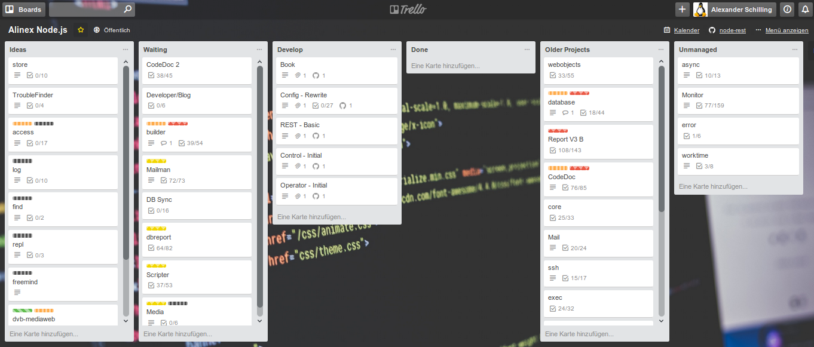

# Trello

Trello is a free online tool using a kanban board like visual display of cards. It's a general too which may be used for nearly everything but it is also very simple and reduced in features for coding.

Each card has:

-   title
-   description
-   comments
-   check lists
-   labels
-   assignee
-   due dates

The planning lines are freely definable and cards are moved by drag and drop. A mobile app is also available to use.

{!docs/abbreviations.txt!}

