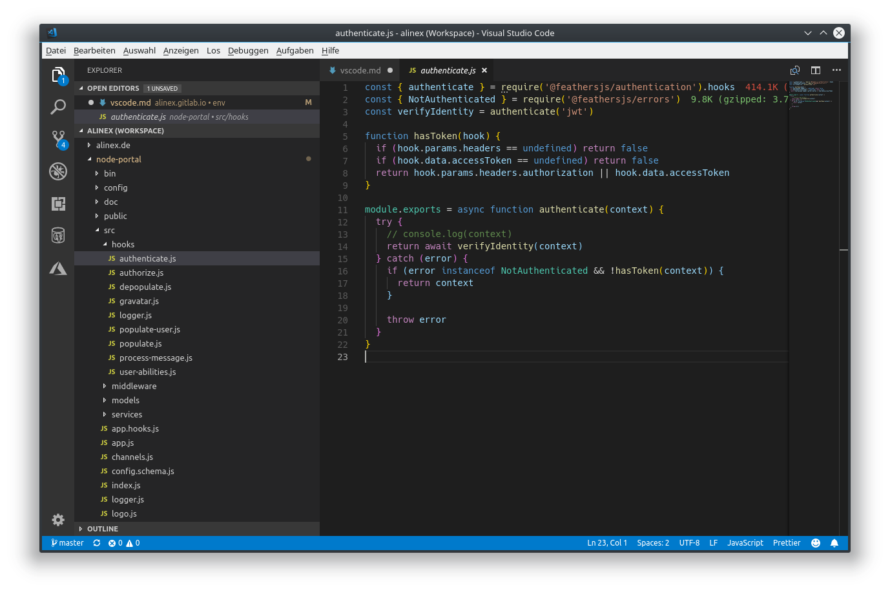
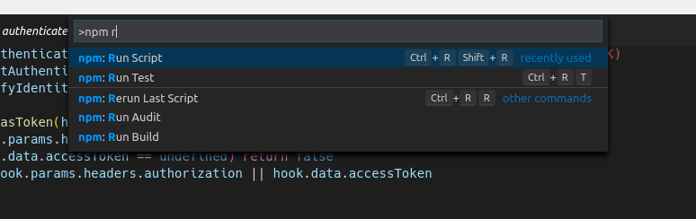
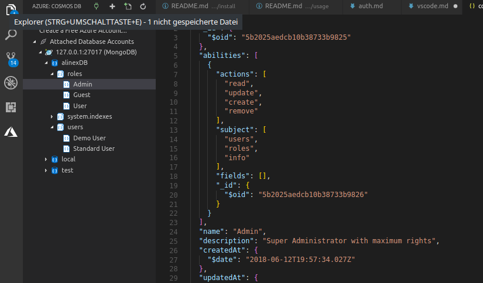

title: VS Code

# VS Code Editor

Microsoft Visual Studio Code is a free, open source code editor for developing and debugging. It runs on any OS and unlike large development environments (Microsoft Visual Studio, Eclipse...) it won't need a project setup before.

VS Code uses the information it finds in the files and folders to provide project and platform-specific functions, such as matching auto complete.

VS Code supports a variety of programming, markup, and database languages, from JavaScript, HTML, and CSS, through C #, C ++, and Python, to PHP and SQL, just to name a few. Common languages usually already included in the standard scope of the editor, other languages are available as an extension. In addition to pure syntax highlighting, auto completion is also provided for some languages, meaningfully supplementing user input: a pop-up displays previously declared variables, methods, functions, and objects that can be accessed in the program context, as well as extensive templates of commonly used pieces of code (templates and snippets).

## Installation

On Debian you may install using the repository, to do the updates with your normal system updates:

```bash
# add repository
curl https://packages.microsoft.com/keys/microsoft.asc | gpg --dearmor > microsoft.gpg
sudo install -o root -g root -m 644 microsoft.gpg /etc/apt/trusted.gpg.d/
sudo sh -c 'echo "deb [arch=amd64] https://packages.microsoft.com/repos/vscode stable main" > /etc/apt/sources.list.d/vscode.list'
sudo apt-get install apt-transport-https
# install VS Code
sudo apt-get update
sudo apt-get install code
```

### User Settings

Visual Studio Code can be configured to your personal needs. The base for this is a JSON configuration file.
Using the command `Preferences: Open User Settings` you can open a view with the default configuration on the left and your settings on the right side. You can only change the ones on the right side.

But you can also use the configuration form which is reachable using the gear icon on the lower left or ++ctrl+,++. This dialog shows a tree structured form with some of the most essential settings for the core and the extensions.

I used at least the following editor settings:

```json
{
    "editor.formatOnSave": true,
    "editor.tabSize": 2,
    "editor.detectIndentation": false,
    "editor.multiCursorModifier": "ctrlCmd"
}
```

The last one is necessary on my KDE based Linux Distribution because ++alt+left-button++ is already used by the os.

### Workspace or Project Settings

You can also add a `settings.json` within the `/.vscode` folder in your project which will overwrite the user settings. This is a convenient way to set project specific settings which are needed for every user.

## User Interface

The user interface of Visual Studio Code is divided into directory tree, editor and console.
In VS code, multiple editor windows can be opened next to each other thanks to split or side-by-side editing. Multiple selection allows you to interactively change multiple lines at the same time, for example, when renaming variables. Code navigation enables targeted searches for specific codes, such as methods or symbols.



The UI pattern is similar to other editors such as Sublime Text and Atom: on the left is a file manager that displays all the files and folders in the current directory. Right next to it is the actual editor. There is space for various panels, such as a terminal or a log for errors and warnings. The user interface can be flexibly adapted to your own needs.

> If you need to do something always consider to lookup for included commands using ++f1++ and search for them.

## Commands

Use ++f1++ or the key combination ++ctrl+shift+p++ to open the command palette. The editor can be operated with keyboard commands via them so that you can do without the mouse almost completely. The command palette is an input box that displays a list of all available commands; it is therefore not necessary to remember the shortcuts of all commands. This list can be filtered by entering the command you are looking for and using the arrow keys to search. With Enter a command is executed.



The command palette of VS Code knows different modes:

-   ++greater++ default command mode commands are executed as usual.
-   ++"#"++ and ++"@"++ to search for symbols such as methods and variables in the current workspace or file.
-   ++colon++ jumps to the given line number
-   ++ctrl+p++ search for open files by typing their name. All files in the currently open folder are searched.

The command palette of VS Code can do even more use ++"?"++ displays a list of all modes.

## Shortcuts

All the shortcuts can be shown directly in the editor calling `Preferences` -> `Keyboard Shortcuts` and you can also search and change them in this table. Althought the most used ones will be shown here:

General

-   ++ctrl+shift+p++ or ++f1++ Show Command Palette
-   ++ctrl+p++ Quick Open, Go to File...
-   ++ctrl+shift+n++ New window/instance
-   ++ctrl+w++ Close window/instance
-   ++ctrl+","++ Open User Settings
-   ++ctrl+k++ ++ctrl+s++ Keyboard Shortcuts

Basic editing

-   ++ctrl+x++ Cut line (empty selection)
-   ++ctrl+c++ Copy line (empty selection)
-   ++alt+down++ / ++alt+up++ Move line down/up
-   ++ctrl+shift+k++ Delete line
-   ++ctrl+enter++ / ++ctrl+shift+enter++ Insert line below/ above
-   ++ctrl+shift+"\"++ Jump to matching bracket
-   ++ctrl+j++ / ++ctrl+"["++ Indent/Outdent line
-   ++ctrl+home++ / ++ctrl+end++ Go to beginning/end of file
-   ++ctrl+up++ / ++ctrl+down++ Scroll line up/down
-   ++alt+page-up++ / ++alt+page-down++ Scroll page up/down
-   ++ctrl+shift+"["++ / ++ctrl+shift+"]"++ Fold/unfold region
-   ++ctrl+k++ ++ctrl+"["++ / ++ctrl+k++ ++ctrl+"]"++ Fold/unfold all subregions
-   ++ctrl+k++ ++ctrl+0++ / ++ctrl+k++ ++ctrl+j++ Fold/Unfold all regions
-   ++ctrl+k++ ++ctrl+c++ Add line comment
-   ++ctrl+k++ ++ctrl+u++ Remove line comment
-   ++ctrl+"/"++ Toggle line comment
-   ++ctrl+shift+a++ Toggle block comment
-   ++alt+z++ Toggle word wrap

Rich languages editing

-   ++ctrl+space++ Trigger suggestion
-   ++ctrl+shift+space++ Trigger parameter hints
-   ++ctrl+shift+i++ Format document
-   ++ctrl+k++ ++ctrl+f++ Format selection
-   ++f12++ Go to Definition
-   ++ctrl+shift+F10 Peek Definition
-   ++ctrl+k++ ++f12++ Open Definition to the side
-   ++ctrl+"."++ Quick Fix
-   ++shift+f12++ Show References
-   ++f2++ Rename Symbol
-   ++ctrl+k++ ++ctrl+x++ Trim trailing whitespace
-   ++ctrl+k++ ++m++ Change file language

Multi-cursor and selection

-   ++ctrl+left-button++ Insert cursor (changed by multi cursor setting above)
-   ++shift+alt+up++ / ++shift+alt+down++ Insert cursor above/below
-   ++ctrl+u++ Undo last cursor operation
-   ++shift+alt+i++ Insert cursor at end of each line selected
-   ++ctrl+i++ Select current line
-   ++ctrl+shift+l++ Select all occurrences of current selection
-   ++ctrl+f2++ Select all occurrences of current word
-   ++shift+alt+right++ Expand selection
-   ++shift+alt+left++ Shrink selection
-   ++shift+alt+"drag mouse"++ Column (box) selection

Display

-   ++f11++ Toggle full screen
-   ++shift+alt+0++ Toggle editor layout (horizontal/vertical)
-   ++ctrl+"="++ / ++ctrl+"-"++ Zoom in/out
-   ++ctrl+b++ Toggle Sidebar visibility
-   ++ctrl+shift+e++ Show Explorer / Toggle focus
-   ++ctrl+shift+f++ Show Search
-   ++ctrl+shift+g++ Show Source Control
-   ++ctrl+shift+d++ Show Debug
-   ++ctrl+shift+x++ Show Extensions
-   ++ctrl+shift+h++ Replace in files
-   ++ctrl+shift+j++ Toggle Search details
-   ++ctrl+shift+c++ Open new command prompt/terminal
-   ++ctrl+k++ ++ctrl+h++ Show Output panel
-   ++ctrl+shift+v++ Open Markdown preview
-   ++ctrl+k++ ++v++ Open Markdown preview to the side
-   ++ctrl+k++ ++z++ Zen Mode (Esc Esc to exit)

Search and replace

-   ++ctrl+f++ Find
-   ++ctrl+h++ Replace
-   ++f3++ / ++shift+f3++ Find next/previous
-   ++alt+enter++ Select all occurrences of Find match
-   ++ctrl+d++ Add selection to next Find match
-   ++ctrl+k++ ++ctrl+d++ Move last selection to next Find match

Navigation

-   ++ctrl+t++ Show all Symbols
-   ++ctrl+g++ Go to Line...
-   ++ctrl+p++ Go to File...
-   ++ctrl+shift+o++ Go to Symbol...
-   ++ctrl+shift+m++ Show Problems panel
-   ++f8++ Go to next error or warning
-   ++shift+f8++ Go to previous error or warning
-   ++ctrl+shift+tab++ Navigate editor group history
-   ++ctrl+alt+"-"++ Go back
-   ++ctrl+shift+"-"++ Go forward
-   ++ctrl+m++ Toggle Tab moves focus

Editor management

-   ++ctrl+w++ Close editor
-   ++ctrl+k++ ++f++ Close folder
-   ++ctrl+"\"++ Split editor
-   ++ctrl+1++ / ++ctrl+2++ / ++ctrl+3++ Focus into 1st, 2nd, 3rd editor group
-   ++ctrl+k++ ++ctrl+left++ Focus into previous editor group
-   ++ctrl+k++ ++ctrl+right++ Focus into next editor group
-   ++ctrl+shift+page-up++ Move editor left
-   ++ctrl+shift+page-down++ Move editor right
-   ++ctrl+k++ ++left++ Move active editor group left/up
-   ++ctrl+k++ ++right++ Move active editor group right/down

File management

-   ++ctrl+n++ New File
-   ++ctrl+o++ Open File...
-   ++ctrl+s++ Save
-   ++ctrl+shift+s++ Save As...
-   ++ctrl+w++ Close
-   ++ctrl+k++ ++ctrl+w++ Close All
-   ++ctrl+shift+t++ Reopen closed editor
-   ++ctrl+k++ ++Enter Keep preview mode editor open
-   ++ctrl+tab++ Open next
-   ++ctrl+shift+tab++ Open previous
-   ++ctrl+k++ ++p++ Copy path of active file
-   ++ctrl+k++ ++r++ Reveal active file in Explorer
-   ++ctrl+k++ ++d++ Show active file in new window/instance

Debug

-   ++f9++ Toggle breakpoint
-   ++f5++ Start / Continue
-   ++f11++ / ++shift+f11++ Step into/out
-   ++f10++ Step over
-   ++shift+f5++ Stop
-   ++ctrl+k++ ++ctrl+i++ Show hover

Integrated terminal

-   ++ctrl+"`"++ Show integrated terminal
-   ++ctrl+shift+"`"++ Create new terminal
-   ++ctrl+shift+c++ Copy selection
-   ++ctrl+shift+v++ Paste into active terminal
-   ++ctrl+shift+up++ / ++ctrl+shift+down++ Scroll up/down
-   ++shift+page-up++ / ++shift+page-down++ Scroll page up/down
-   ++shift+home++ / ++shift+end++ Scroll to top/bottom

## Tasks

You can run different tasks which are possible to be run on the command line directly from within the VSCode IDE.

To define custom tasks call `Configure Tasks` from the global `Tasks` menu and select the `Create tasks.json file` from template entry. Then select `Other` format. You will get a JSON configuration in the current workspace and can define your tasks there:

```json
{
    "version": "2.0.0",
    "tasks": [
        {
            "label": "build",
            "type": "shell",
            "command": "cargo build",
            "group": {
                "kind": "build",
                "isDefault": true
            },
            "problemMatcher": []
        },
        {
            "label": "test",
            "type": "shell",
            "command": "cargo test",
            "group": {
                "kind": "test",
                "isDefault": true
            }
        }
    ]
}
```

The task's properties have the following semantic:

-   `label` - The task's label used in the user interface.
-   `type` - The task's type. For a custom task, this can either be `shell` or `process`. If shell is specified, the command is interpreted as a shell command. If process is specified, the command is interpreted as a process to execute.
-   `command` - The actual command to execute.
-   `args` - Optionally array used if they are not given as a one liner within the command call
-   `windows` - Any Windows OS specific properties.
-   `group` - Defines to which group the task belongs.
-   `presentation` - Defines how the task output is handled in the user interface.

Call the tasks using ++f1++ with `tasks`.

Read more at [VSCode Tasks](https://code.visualstudio.com/docs/editor/tasks).

## Debugger

The sleek and flexible Code Editor gives developers all the functionality they need to get the job done. This is mainly due to the good integration of the debugger and the direct Git connection. VS Code is perfect for all scripting languages. There are some enhancements in Marketplace for better handling...

With the Chrome Debugger extension, front-end developers can debug their JavaScript code with Google Chrome. VS Code uses the Chrome DevTools Protocol, which associates the files loaded in the browser with the files opened in the editor. This allows the developer to place breakpoints directly into VS code, watch variables, or see the entire call stack as they debug - all without leaving the editor. A very useful extension that you should definitely look at as a front-end developer.

## Extensions

The standard functionality of VS Code can be extended with additional packages that can adapt almost anything, from the appearance and behavior of the user interface to core editor functions. Microsoft's code editor brings with it a package manager. Additional languages, debuggers and tools can be easily installed.

In the chapters below I comment on some plugins. To get more information search for the extension in the editor and read the detailed description.
Shortcut to get to them is ++ctrl+shift+x++ or open it with the square icon on the left.

The editor will also sometimes show you some recommended extensions based on the files you opened.

### Project Manager

[Project Manager](https://github.com/alefragnani/vscode-project-manager/blob/master/README.md) add a new sidebar to easily switch between projects. After configuring each project you can easily select the project in the new sidebar which switches to this project and Explorer and Source Control will both hold this.

### Code Formatting

[Prettier](https://marketplace.visualstudio.com/items?itemName=esbenp.prettier-vscode) enables VS Code to automatically optimize the format to the default style guides. A good way is to enable it on save in the settings.

You can customize some parameters, I used to set the following to mainly have markdown which is fully compatible with [MkDocs](mkdocs.md) for markdown parsing (spesifically the tabWidth of 4 spaces is needed to use lists with multiline points).

```json
{
    "prettier.printWidth": 100,
    "prettier.tabWidth": 4,
    "editor.formatOnSave": true
}
```

Also auto formatting on save is enabled in the above.

### Spellchecker

Use [Spell Right](https://marketplace.visualstudio.com/items?itemName=ban.spellright) as spell checker which is using `hunspell` dictionaries. To make it work install also the `hunspell` dictionaries like:

```bash
sudo apt install hunspell hunspell-en-us hunspell-de-de
ln -s /usr/share/hunspell ~/.config/Code/Dictionaries
```

By using ++f8++ or ++shift+f8++ you can jump to the next/previous error in the document. With the cursor over a misspelled word use ++ctrl+.++ to open a context menu with correct spelling or the ability to add the word to the dictionary.

If you start using this you will have to add lots of specific words from the technical range into the user dictionary but after that it works better and better.
The dictionary will be stored under `.vscode/spellright.dict` within your project.

Sometimes you see encoding problems like in german Umlaut. This can be fixed by converting the dictionary files to UTF-8. To find the dictionary files call `hunspell -D` and then for the problematic dictionaries:

```bash
sudo cp /usr/share/hunspell/de_DE.aff /usr/share/hunspell/de_DE.aff.bak
sudo cp /usr/share/hunspell/de_DE.dic /usr/share/hunspell/de_DE.dic.bak
sudo iconv -f iso-8859-1 -t UTF-8 /usr/share/hunspell/de_DE.aff.bak | sudo tee /usr/share/hunspell/de_DE.aff
sudo iconv -f iso-8859-1 -t UTF-8 /usr/share/hunspell/de_DE.dic.bak | sudo tee /usr/share/hunspell/de_DE.dic
```

You have to restart your IDE or if that won't work the whole system to take effect.

### Git

Nowadays Git is a central tool for many developers. But if you have to switch to the command line or other GUI application while programming to check or uncheck code, it will interrupt the workflow. That's why Microsoft VS Code comes with Git integration by default. This provides the developer with the most important Git operations in the editor.

[GitLens](https://marketplace.visualstudio.com/items?itemName=eamodio.gitlens) supercharges the Git capabilities built into Visual Studio Code. It helps you to visualize code authorship at a glance via Git blame annotations and code lens, seamlessly navigate and explore Git repositories, gain valuable insights via powerful comparison commands, and so much more.
All this is available through a new Icon on the left sidebar menu.

### Markdown

-   `Markdown All in One` - All you need for Markdown (keyboard shortcuts, table of contents, auto preview and more).
-   `markdown lint` - The Markdown lint will check the syntax of the markdown files and give hints for proper standardized markdown which will work.

To configure MarkdownLint add something like the following:

!!! example "User Settings"

    ```json
    "markdownlint.config": {
        "MD007": { "indent": 4 },
        "MD013": false,
        "MD030": {
            "ul_single": 3,
            "ol_single": 2,
            "ul_multi": 3,
            "ol_multi": 2
        },
        "MD041": false
    }
    ```

See also the [rules](https://github.com/DavidAnson/markdownlint#rules--aliases) description.

### Rust Programming

The [Rust](https://marketplace.visualstudio.com/items?itemName=kalitaalexey.vscode-rust) plugin includes:

-   Rust Language Server integration.
-   Auto completion (via `racer` or `RLS`).
-   Go To Definition (via `racer` or `RLS`).
-   Go To Symbol (via `rustsym` or `RLS`).
-   Code formatting (via `rustfmt`).
-   Code Snippets.
-   Cargo tasks (`Ctrl-Shift-p` and type cargo to view them).

Also the following extensions may help:

-   `Better TOML` - TOML configuration files syntax highlighting
-   `CodeLLDB` - LLDB debugging for Rust programs
-   `Rust (RLS)` - the language server
-   `search-crates-io` - auto complete search within `Cargo.toml`
-   [`crates`](https://marketplace.visualstudio.com/items?itemName=serayuzgur.crates) - will display latest version in `Cargo.toml` and allows to switch through hover list

Keep in mind that if you just installed Rust you have to sometimes reboot your systems to find the new commands in the path.
After that VSCode will ask for tool chain...

### Mongo DB

Visual Studio Code has great support for working with [MongoDB](https://www.mongodb.com/what-is-mongodb) databases. Through the [Azure CosmosDB extension](https://marketplace.visualstudio.com/items?itemName=ms-azuretools.vscode-cosmosdb), you can create, manage and query MongoDB databases from within VS Code.

After installing you will find it in the Activity Bar under **Azure**.

You can:

-   connect to a MongoDB server
-   browse through your collections
-   show entries
-   change and update them
-   make `*.mongo` scripts with code completion
-   execute the scripts

To setup the database connection open the Azure activity bar, select 'Attached Database Accounts' -> 'Attach Database Account...' then select 'MongoDB' and give the server address.



You can navigate through the database like through a file system.

### PostgreSQL

This will give you access to PostgreSQL databases and allows to query them.

### VueJS Extension Pack

This already comes with a lot of extension needed for working with Vue:

-   `npm` - This extension supports running npm scripts defined in the `package.json` file and validating the installed modules against the dependencies defined in the `package.json`
-   `NPM IntelliSense` - Visual Studio Code plugin that auto completes npm modules in import statements
-   `Import Cost VSCode` - This extension will display inline in the editor the size of the imported package. The extension utilizes `webpack` with `babili-webpack-plugin` in order to detect the imported size.
-   `Prettier - Code formatter` - VS Code package to format your JavaScript / TypeScript / CSS using Prettier.
-   `vetur` - Vue tooling for VS Code, powered by vue-language-server.
-   `vue-peek` - This extension extends Vue code editing with Go To Definition and Peek Definition support for components and filenames in single-file components with a .vue extension. It allows quickly jumping to or peeking into files that are referenced as components (from template), or as module imports
-   `auto-rename-tag` - Automatically rename paired HTML/XML tag, same as Visual Studio IDE does.
-   `auto-close-tag` - Automatically add HTML/XML close tag, same as Visual Studio IDE or Sublime Text does.
-   `Sorting HTML and Jade attributes` - Sorting of the tag attributes in the specified order.
-   `Bracket Pair Colorizer` - This extension allows matching brackets to be identified with colors. The user can define which characters to match, and which colors to use.

ESLint - Integrates ESLint into VS Code. If you are new to ESLint check the documentation.

### REST Client

Write your requests in editor with syntax highlighting and auto completion, send and view the response in a separate pane with syntax highlighting. Also you can create a curl call out of it. Multiple requests in one file are supported by `###` as a delimiter line.

### Edit with Shell

This plugin lets you easily call shell commands and get the output within the editor. It can also send the marked text through the command and replace it with the output.

You may add the key binding:

```json
{
    "key": "ctrl-r ctrl-r",
    "command": "editWithShell.runCommand",
    "when": "editorTextFocus"
}
```

### Remote - SSH

Allows you to open a remote folder from any remote machine, virtual machine, or container with a running SSH server and take full advantage of VS Code's feature set. Once connected to a server, you can interact with files and folders anywhere on the remote filesystem.

### Misc

-   `Material Icon Theme` - lots of icons based on Material Design

{!docs/abbreviations.txt!}
