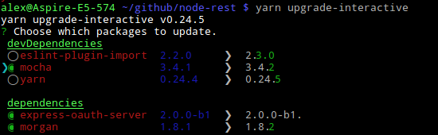

title: NPM

# NodeJS Package Manager

Traditionally `npm` is used as package manager for NodeJS but you may also use
`yarn` package manager which offered more speed till npm V5 (NodeJS 8). Within
this book we mostly keep going with the default npm but both works the same.

## NodeJS

But before you need the [NodeJS](https://nodejs.org) system installed using the
instructions on the website. It already comes with the NPM package manager.

Which version to use is based on the modules you want to run. But while NodeJS
is mostly very good in backward compatibility also over major versions you should
to go with the latest stable LTS (long term support) version.

### Node version manager

For development systems you may test different versions so you may want to switch
between versions on demand. This is possible using the [`nvm`](https://github.com/creationix/nvm)
version manager. This allows you to try out your code in different versions and
find problems.

Install it using the script:

```bash
curl -o- https://raw.githubusercontent.com/creationix/nvm/v0.33.2/install.sh | bash
```

Then you may directly use it. It can install other versions and switch between
versions easily.

Some of the commands are:

| Command                        | Usage                                     |
| ------------------------------ | ----------------------------------------- |
| `nvm current`                  | display currently activated version       |
| `nvm ls [<version>]`           | list installed versions                   |
| `nvm ls-remote [<version>]`    | list versions available for install       |
| `nvm version <version>`        | get best matching installed version       |
| `nvm version-remote <version>` | get best matching remote version          |
| `nvm install <version>`        | download and install a version            |
| `nvm uninstall <version>`      | uninstall a version                       |
| `nvm use <version>`            | modify path to use version                |
| `nvm which <version>`          | show path there this version is installed |

All node installations are done within the `~/.nvm` directory.

If you detect that the module won't work with specific versions of node you should
define the working versions in `package.json`.

#### Upgrade to new version

The following command will not only install a new version but also install all
global modules which were installed in the current version.

```bash
$ nvm current
v8.0.0
$ nvm version-remote 8
v8.1.0
$ nvm install 8.1 --reinstall-packages-from=8.0
Downloading and installing node v8.1.0...
Downloading https://nodejs.org/dist/v8.1.0/node-v8.1.0-linux-x64.tar.xz...
######################################################################## 100,0%
Computing checksum with sha256sum
Checksums matched!
Now using node v8.1.0 (npm v5.0.3)

Reinstalling global packages from v8.0.0...
+ flow-bin@0.47.0
added 9 packages and updated 1 package in 2.463s
Linking global packages from v8.0.0...
```

But after you changed your node version you should call `npm install` in your
module again.

## NPM

[npm](https://docs.npmjs.com) makes it easy for JavaScript developers to share and
reuse code, and it makes it easy to update the code that you're sharing. npm is

- a package manager for JavaScript
- a free and open package repository

The npm package repository contains hundreds of thousands of packages. Which can
be easily installed and included in your code.

### NPM Installation

npm is bundled with NodeJS and installed with it. To update it to the newest version
you may call:

```bash
sudo npm update -g npm
```

See the usage below.

### New in npm 5

- standardized lock-file `package-lock.json` is supported
- `--save` is no longer necessary but `--save-dev` and `--save-optional` have to be used if needed
- speeding up installation by using symlinks to centralized store
- top level `preinstall` scripts now run before anything else
- added `prepack` and `postpack`, which will not run on install only on publish
- `prepublishOnly` now runs before the archive to publish is created
- optimized output
- lots of other fixes and optimization

## Yarn

[Yarn](https://yarnpkg.com) is an alternative JavaScript package manager built by Facebook,
Google, Exponent and Tilde.
Yarn is only a new CLI client that fetches modules from the npm registry. But now with
the upcoming npm 5 shipped with Node 8 the differences are smelting down.

### yarn.lock

In `package.json`, the file where both npm and Yarn keep track of the project’s
dependencies, version numbers aren’t always exact. Instead, you can define a range
of versions. This way you can choose a specific major and minor version of a package,
but allow npm to install the latest patch that might fix some bugs.

In an ideal world of semantic versioning, patched releases won’t include any breaking
changes. This, unfortunately, is not always true. The strategy employed by npm may
result into two machines with the same `package.json` file, having different versions
of a package installed, possibly introducing bugs.

To avoid package version mis-matches, an exact installed version is pinned down in a
lock file. Every time a module is added, Yarn creates (or updates) a `yarn.lock` file.
This way you can guarantee another machine installs the exact same package, while
still having a range of allowed versions defined in package.json.

It is automatically working like npm with `npm-shrinkwrap.json` or npm since V5.

### Parallel Installation

Whenever npm or Yarn needs to install a package, it carries out a series of tasks.
In npm, these tasks are executed per package and sequentially, meaning it will wait
for a package to be fully installed before moving on to the next. Yarn executes these
tasks in parallel, increasing performance.

### Cleaner Output

By default npm is very verbose. For example, it recursively lists all installed packages
when running `npm install <package>`. Yarn on the other hand, isn’t verbose at all.
When details can be obtained via other commands, it lists significantly less information
with appropriate emojis.

### Yarn Installation

Use npm to install yarn:

```bash
sudo npm install -g yarn
```

To update Yarn run the same call again.

## Management Tasks

The following tasks are often needed and will be displayed how to do them in both.
Other than some functional differences, Yarn also has different commands. Some npm
commands were removed, others modified and a couple of interesting commands were added.

### Install globally

```bash
# npm call
$ sudo npm install -g <package>
# yarn call
$ sudo yarn global add <package>
```

Unlike npm, where global operations are performed using the `-g` or `--global` flag,
Yarn commands need to be prefixed with global.

### Install Module

```bash
# npm call
$ npm install <package>
# npm befor v5 needs the save flag
$ npm install <package> --save
# yarn call
$ yarn add <package>
```

This will install dependencies from the `package.json` file and allows you to add
new packages.

For development modules use:

```bash
# npm call
$ npm install <package> --save-dev
# yarn call
$ yarn add <package> --dev
```

### Remove Package

```bash
# npm call
$ npm remove <package> --save
# yarn call
$ yarn remove <package>
```

This will remove the package and the dependencies from the `package.json` file.

### Outdated packages

```bash
# npm call, first set the version in package.json
$ npm outdated
# yarn call, will ask for new version
$ yarn outdated
```

This will list the packages which are outdated.


### Upgrade package

```bash
# npm call
$ npm update <package> --save
# yarn call
$ yarn upgrade <package>
```

This command upgrades packages to the latest version conforming to the version rules
set in `package.json` (and recreates `yarn.lock`).

Interestingly, when specifying a package, it updates that package to latest release
and updates the tag defined in `package.json`. This means this command might update
packages to a new major release.

### Upgrade interactive

```bash
# npm call
$ sudo npm install -g npm-check
$ npm-check -u
# yarn call
$ yarn upgrade-interactive
```

This tool allows you to interactively decide what to upgrade.



### Run script

```bash
# npm call, the option -s is optional and suppress the mostly unwanted error hints
$ npm run <script> -s
# yarn call
$ yarn run <script>
# yarn alternative if script name not equal yarn commands
$ yarn <script>
```

You can run the scripts defined in `package.json`. With both you can call the
binaries located in `node_modules/.bin` directly without prefixing this path.

### NPM Login

```bash
# npm call, first set the version in package.json
$ npm login
# yarn call, will ask for new version
$ yarn login
```

Both will ask and store the credentials to access the npm package repository.

### Publish

```bash
# npm call, first set the version in package.json
$ npm publish
# yarn call, will ask for new version
$ yarn publish
```

While npm published the package using the version from `package.json`, Yarn will
interactively ask for it and update package.json for you.

You can also group packages in a scope (namespace). Each user has a scope with it's user or organization name. To publish something in this scope you have to use `@<scope>/<name>` and also need to add `--access public` because private packages are only valid for payed customers.

### License Management

At the time of writing, no npm equivalent is available. `yarn licenses ls` lists
the licenses of all installed packages. `yarn licenses generate-disclaimer` generates
a disclaimer containing the contents of all licenses of all packages. Some licenses
state that you must include the project’s license in your project, making this a rather
useful tool to do that.

### Yarn Analysis

This command peeks into the dependency graph and figures out why given package is
installed in your project. Perhaps you explicitly added it, perhaps it’s a dependency
of a package you installed. `yarn why` helps you figure that out.


{!docs/abbreviations.txt!}

