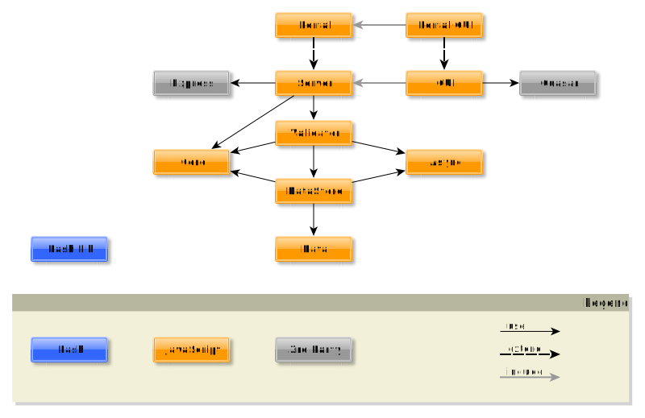

title: Overview

# Solutions

What is presented here as solutions are concepts, ideas, modules and also complete working products. See it as the good things you can get out of this whole book.

Most of the book was written while I worked on this solutions so they are the successor of this book. This site contains description about basic concepts but will only contain short overviews about each product or module with how it works and what's the purpose of it. But to really decide if it can help you solve your problems and needs you have to follow the links to further documentation to check if you may use it.

It's not much at the moment. More solutions will be presented here as far as they are open source and at least partly working. Specific tools sometimes mentioned in my blog which are special to a client can not be integrated here. Also some of my older codes are not included here because they don't match my newer quality standards and may be integrated later, if they've been rewritten.

{: .center}

Only the major third party modules are shown here.

**[DevOps](devops.md)**
: This will contain solutions from the operations area which can be used to make the tasks there more automatic.

**[Applications](applications.md)**
: Real applications, which can be installed, configured and used by anybody.

**[Modules](modules.md)**
: This contains base modules which help you to start developing your project. Have a look at them and check what you need and what not. Include them as needed.

**[Playground](playground.md)**
: My example applications are working but not fully functional. They are used as a base to develop them further for your needs. You can fork them and continue the development with adding your own modules...

**[Quality Standards](quality.md)**
: These are seen as goals, more like a vision, meaning not every goal may be reached or completely reached. But you should try to fulfill these as much as possible.

Smaller language specific concepts can also be found under: [Rust](../solutions).

{!docs/abbreviations.txt!}
