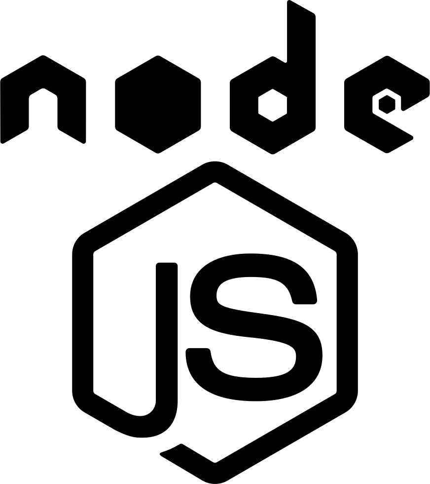

# Applications

This page will collect applications which are ready to use. So install them, configure them and use them right away.

{: .right .icon}

## Web and REST Server

A pre-configured and opinionated but ready to use Web and REST Server which can easily be used as backend to other services or any frontend type. It's the successor of the Portal Server (see below).

-   [Source](https://gitlab.com/alinex/node-server)
-   [Documentation](https://alinex.gitlab.io/node-server)

{: .right .icon}

## GUI Client for Server

The Alinex GUI Client is a modern web application which can be also be used as application on nearly any platform. It is also written using TypeScript and uses a modular concept and a modern client. You may use it as SPA, PWA, SSR, Android or IOS App, Windows, Mac or Linux Application all from the same code base.

-   [GUI Client](https://alinex.gitlab.io/node-gui)
-   [Documentation](https://alinex.gitlab.io/node-gui)

{: .right .icon}

## Small Tools based on NodeJS (older)

-   [dbreport](http://alinex.github.io/node-dbreport/) tool to query database and send results as email attachments
-   [mailman](http://alinex.github.io/node-mailman/) management console based on email
-   [worktime](http://alinex.github.io/node-worktime/) command line application for logging work times

{!docs/abbreviations.txt!}
